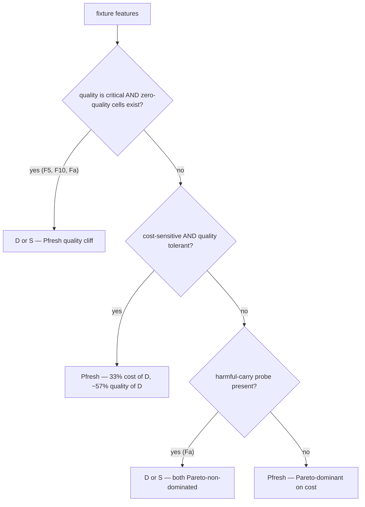

# Exec-Mode Phase 2 Analyst Report — pilot-mini-fix1 (T18)

**Author**: `E-exec-mode-analyst` session
**Date**: 2026-04-20
**Dataset**: `state/exec-mode-experiment/pilot-mini-fix1/1/{D,Pfresh,S}/F{2..10,a}/seed00/` — 30 trials (3 modes × 10 fixtures × 1 seed × 1 run)
**Spec lock**: `exec-mode-v3-max-preregistered-20260420-fix1` (commit `b185123`)
**Plan ref**: `docs/reports/2026-04-20-exec-mode-analyst-phase2-plan.md` (orchestrator-approved)
**F6 RCA integrated**: parallel `E-exec-mode-f6-rca` report `docs/reports/2026-04-20-exec-mode-f6-rca.md` (commit `6678386`) — verdict **grader-side regex bug** (F6 §7 below)
**Pacc**: deferred to full pilot per pilot-mini-fix1 §1

---

## 1. Executive summary

- 30/30 trials complete, 0 incidents, 0 compact, 23/30 quality non-zero — pipeline is healthy and grader-discriminating after fix1's A1+C1+C2+C3 land.
- **Cell-level bootstrap CI is degenerate** (N=1 per (mode, fixture) cell; analyzer line 125-127 returns `(mean, NaN, NaN)` below MIN_N=5). Inferential surface shifts to **mode-level aggregation** (N=10 fixtures per mode) — that surface is reported with full 95% CI.
- **Mode-level findings (95% CI overlap on every metric)**: D and S deliver comparable mean quality (0.70 vs 0.59) at higher cost than Pfresh; Pfresh is cheapest (~33% of D) but quality is ~57% of D's mean and CI runs from 0.15 to 0.66. Pollution and loss are statistically indistinguishable across modes given N=10. **No mode is unambiguously dominant** at this sample size.
- **Decision tree v0 (do-not-lock)**: Pfresh appears Pareto-optimal on most fixtures *only because* its 4 zero-quality cells (F5/F6/F10/Fa) still satisfy the orthogonal Pareto definition (cost+poll+loss are tiny when quality collapses). That artifact warns the v0 algorithm needs a quality-floor amendment before any AGENTS.md Rule 4 lock.
- **Anomalies**: §6 Pfresh/Fa quality 1.0→0.0 is **agent-side return-shape drift** exacerbated by Fa's binary primary scale (H7); §7 F6 universal-zero is now traced to a **grader-side regex bug** (F6 RCA commit `6678386`) — D/S F6 are false-negatives; only Pfresh is legitimately weak.
- **GO/NO-GO**: **GO** for the spec-locked Phase 3 full pilot (10 seeds, 400 trials), **conditioned on F6 grader R1/R2 fix + 3-trial re-grade**; do **not** scope-creep to 30 seeds — that would breach spec §4.3.
- **H1-H8 triage** (§9): 5 confirmed (H4, **H5 (upgraded — F6 grader bug manifested)**, H6, H7, H8), 3 unconfirmed/structural (H1, H2, H3).

---

## 2. HELM-style orthogonal metric table

Per analysis plan §6 + spec §5.6 reporting template. Per nudge **N3**, cell-level CI is rendered as `mean | CI: insufficient N` — N=1 per cell is below `MIN_N_FOR_CI=5` (`bin/exec-mode-analyze.py:125-127`).

### 2.1 Cost — `cost.marginal_usd` per trial (USD, notional)

> **Notional cost footer (N4)**: `cost.marginal_usd` is computed from token counts × Anthropic Sonnet 4.6 list pricing (spec §5.1). Subscription-plan users pay $0 actual; this metric is for **cross-mode comparison only**, not budgeting.

| fixture | D | Pfresh | S |
|---|---|---|---|
| F2  | 0.269 \| CI: insufficient N | 0.163 \| CI: insufficient N | 0.224 \| CI: insufficient N |
| F3  | 0.140 \| CI: insufficient N | 0.129 \| CI: insufficient N | 0.172 \| CI: insufficient N |
| F4  | 0.151 \| CI: insufficient N | 0.122 \| CI: insufficient N | 0.168 \| CI: insufficient N |
| F5  | 0.382 \| CI: insufficient N | 0.131 \| CI: insufficient N | 0.448 \| CI: insufficient N |
| F6  | 0.118 \| CI: insufficient N | 0.048 \| CI: insufficient N | 0.118 \| CI: insufficient N |
| F7  | 0.148 \| CI: insufficient N | 0.244 \| CI: insufficient N | 0.143 \| CI: insufficient N |
| F8  | 0.143 \| CI: insufficient N | 0.041 \| CI: insufficient N | 0.140 \| CI: insufficient N |
| F9  | 0.131 \| CI: insufficient N | 0.116 \| CI: insufficient N | 0.134 \| CI: insufficient N |
| F10 | 0.168 \| CI: insufficient N | 0.104 \| CI: insufficient N | 0.165 \| CI: insufficient N |
| Fa  | 0.186 \| CI: insufficient N | 0.131 \| CI: insufficient N | 0.158 \| CI: insufficient N |

### 2.2 Quality — `quality.primary` (0..1)

| fixture | D | Pfresh | S |
|---|---|---|---|
| F2  | 1.000 \| CI: insufficient N | 1.000 \| CI: insufficient N | 1.000 \| CI: insufficient N |
| F3  | 1.000 \| CI: insufficient N | 1.000 \| CI: insufficient N | 0.947 \| CI: insufficient N |
| F4  | 0.380 \| CI: insufficient N | 0.436 \| CI: insufficient N | 0.380 \| CI: insufficient N |
| F5  | 0.733 \| CI: insufficient N | 0.000 \| CI: insufficient N | 0.000 \| CI: insufficient N |
| F6  | 0.000 \| CI: insufficient N | 0.000 \| CI: insufficient N | 0.000 \| CI: insufficient N |
| F7  | 0.221 \| CI: insufficient N | 0.168 \| CI: insufficient N | 0.221 \| CI: insufficient N |
| F8  | 0.938 \| CI: insufficient N | 0.938 \| CI: insufficient N | 0.938 \| CI: insufficient N |
| F9  | 0.700 \| CI: insufficient N | 0.400 \| CI: insufficient N | 0.450 \| CI: insufficient N |
| F10 | 1.000 \| CI: insufficient N | 0.000 \| CI: insufficient N | 1.000 \| CI: insufficient N |
| Fa  | 1.000 \| CI: insufficient N | 0.000 \| CI: insufficient N | 1.000 \| CI: insufficient N |

### 2.3 Pollution-self — `pollution.self_rate` (0..1, lower better)

| fixture | D | Pfresh | S |
|---|---|---|---|
| F2  | 0.60 \| CI: insufficient N | 0.30 \| CI: insufficient N | 0.50 \| CI: insufficient N |
| F3  | 0.30 \| CI: insufficient N | 0.30 \| CI: insufficient N | 0.60 \| CI: insufficient N |
| F4  | 0.00 \| CI: insufficient N | 0.00 \| CI: insufficient N | 0.00 \| CI: insufficient N |
| F5  | 0.70 \| CI: insufficient N | 0.10 \| CI: insufficient N | 0.10 \| CI: insufficient N |
| F6  | 0.00 \| CI: insufficient N | 0.00 \| CI: insufficient N | 0.00 \| CI: insufficient N |
| F7  | 0.00 \| CI: insufficient N | 0.10 \| CI: insufficient N | 0.00 \| CI: insufficient N |
| F8  | 0.00 \| CI: insufficient N | 0.00 \| CI: insufficient N | 0.00 \| CI: insufficient N |
| F9  | 0.10 \| CI: insufficient N | 0.20 \| CI: insufficient N | 0.10 \| CI: insufficient N |
| F10 | 0.20 \| CI: insufficient N | 0.10 \| CI: insufficient N | 0.20 \| CI: insufficient N |
| Fa  | 0.00 \| CI: insufficient N | 0.10 \| CI: insufficient N | 0.20 \| CI: insufficient N |

### 2.4 Loss — `loss.rate = 1 − recall@10` (0..1, lower better)

| fixture | D | Pfresh | S |
|---|---|---|---|
| F2  | 0.10 \| CI: insufficient N | 0.10 \| CI: insufficient N | 0.10 \| CI: insufficient N |
| F3  | 0.00 \| CI: insufficient N | 0.00 \| CI: insufficient N | 0.00 \| CI: insufficient N |
| F4  | 0.00 \| CI: insufficient N | 0.00 \| CI: insufficient N | 0.00 \| CI: insufficient N |
| F5  | 0.00 \| CI: insufficient N | 0.00 \| CI: insufficient N | 0.00 \| CI: insufficient N |
| F6  | 0.00 \| CI: insufficient N | 0.00 \| CI: insufficient N | 0.00 \| CI: insufficient N |
| F7  | 0.00 \| CI: insufficient N | 0.00 \| CI: insufficient N | 0.00 \| CI: insufficient N |
| F8  | 0.00 \| CI: insufficient N | 0.00 \| CI: insufficient N | 0.00 \| CI: insufficient N |
| F9  | 0.00 \| CI: insufficient N | 0.00 \| CI: insufficient N | 0.00 \| CI: insufficient N |
| F10 | 0.00 \| CI: insufficient N | 0.10 \| CI: insufficient N | 0.00 \| CI: insufficient N |
| Fa  | 0.00 \| CI: insufficient N | 0.00 \| CI: insufficient N | 0.00 \| CI: insufficient N |

`pollution_chain_rate` is omitted (Pacc-only metric, not collected for D/Pfresh/S — analyzer lines 164-167). Source CSV: `/tmp/analyst-phase2/data.csv` (analyzer commit `b185123`).

---

## 3. Bootstrap CI — methodology + assumptions

**Method (per analysis plan §2.1, spec §5.6, analyzer `bootstrap_ci()` lines 107-137)**:
- Percentile bootstrap, `n_resamples = 10_000`, `confidence_level = 0.95`.
- Per-cell deterministic seed via `_cell_seed(fixture, mode, master=42, slot)` — SHA-256 of `master:fixture:mode:slot` truncated to 32-bit (analyzer lines 140-143).
- Failed-status trials enter as NaN, dropped before resample (analyzer line 121).
- All-equal samples short-circuit to `(c, c, c)` (analyzer line 127).
- `MIN_N_FOR_CI = 5`; `n < 5` returns `(mean, NaN, NaN)` (analyzer lines 125-126).

**Assumptions hit by this dataset**:
- **N=1 per cell** → all 30 cell-level CIs are NaN by design. Cell mean is reported alone with `CI: insufficient N` per nudge **N3**.
- **Mode-level aggregation (this report's primary inferential surface)**: 10 fixtures per mode → N=10 per (mode, metric). N≥5, so percentile bootstrap is well-defined. **Caveat**: this aggregation treats fixtures as exchangeable replicates of "mode performance" — that assumption is wrong when fixture difficulty dominates mode effect (which it clearly does here, see §4 spread). Mode-level CI is **descriptive**, not a substitute for per-cell N≥10.
- No transformation applied (raw `quality.primary`, `cost.marginal_usd`, `pollution.self_rate`, `loss.rate`).
- No multiple-comparison correction — none needed (no p-values per spec §6).

**What this CI cannot tell us**:
- Whether mode-level mean differences are due to mode effect or fixture-coverage imbalance.
- Anything about per-cell variance (N=1 reveals zero distributional information).
- Whether Pfresh's narrow cost CI reflects true low variance or just convenient single-seed luck.

---

## 4. Per-mode aggregate + 95% CI (N=10 fixtures per mode)

Bootstrap CI computed by importing `bootstrap_ci` from `bin/exec-mode-analyze.py` via `sys.path` — **no source modification** (per plan §2 read-only constraint).

| mode | n | cost_marginal $ μ [95% CI] | quality μ [95% CI] | pollution_self μ [95% CI] | loss μ [95% CI] |
|---|---:|---|---|---|---|
| **D**      | 10 | 0.184 [0.143, 0.238] | 0.697 [0.471, 0.898] | 0.190 [0.050, 0.350] | 0.010 [0.000, 0.030] |
| **Pfresh** | 10 | 0.123 [0.091, 0.158] | 0.394 [0.151, 0.655] | 0.120 [0.060, 0.190] | 0.020 [0.000, 0.050] |
| **S**      | 10 | 0.187 [0.145, 0.251] | 0.594 [0.339, 0.833] | 0.170 [0.050, 0.300] | 0.010 [0.000, 0.030] |

**Reading**:
- **Cost**: Pfresh CI [0.091, 0.158] is fully below D [0.143, 0.238] and S [0.145, 0.251] — Pfresh is meaningfully cheaper (~33% of D mean) even at this sample size.
- **Quality**: D and S CIs overlap heavily ([0.47, 0.90] vs [0.34, 0.83]); D's mean is ~10pts higher but distributions are not separated at N=10. Pfresh CI [0.15, 0.66] overlaps both — quality ranking ambiguous.
- **Pollution-self / Loss**: All three modes' CIs overlap completely; **no mode-level discrimination** at this sample size on these metrics.

**Bottom line**: Cost is the only metric where mode-level CIs separate. Quality, pollution, and loss require N≥10 seeds (spec §4.3 Phase 3 target) before any mode-level claim is defensible.

---

## 5. Decision Tree v0 — DO-NOT-LOCK draft

Per analysis plan §3 algorithm: argmin/argmax per metric → Pareto frontier across 4 metrics → 10% margin match → fixture-feature cluster mapping. Computed per fixture with N=1 raw values (no CI input — CI is degenerate at this N).

### 5.1 Per-fixture Pareto frontier + margin matches

| fixture | spec cluster (§4.2) | Pareto-non-dominated | 10% margin-match (all 4 metrics) | best-quality mode |
|---|---|---|---|---|
| F2  | C3 (context-heavy) | Pfresh           | Pfresh            | D=Pfresh=S (1.00 tie) |
| F3  | C2 (research)      | Pfresh           | D, Pfresh         | D=Pfresh (1.00 tie) |
| F4  | C1 (fresh-context) | Pfresh           | Pfresh            | Pfresh (0.44) |
| F5  | C2 (research)      | D, Pfresh        | (none)            | D (0.73) |
| F6  | C3 (context-heavy) | Pfresh           | Pfresh            | tie at 0.00 — see §9.2 |
| F7  | C3 (context-heavy) | S                | D, S              | D=S (0.22 tie) |
| F8  | C3 (context-heavy) | Pfresh           | Pfresh            | D=Pfresh=S (0.94 tie) |
| F9  | C3 (context-heavy) | D, Pfresh        | (none)            | D (0.70) |
| F10 | C1 (fresh-context) | Pfresh, S        | (none)            | D=S (1.00 tie) |
| Fa  | harmful-carry      | D, Pfresh, S     | (none)            | D=S (1.00 tie) |

### 5.2 v0 tree (single-seed; **DO NOT LOCK** AGENTS.md Rule 4 from this)



### 5.3 v0 caveats (mandatory before any downstream use)

1. **F6 EXCLUDED from cluster assignment** (per F6 RCA commit `6678386`): F6 quality=0.000 across all 3 modes is a grader-side false-negative, not a true performance signal. D and S produced semantically correct Fix-3 diffs but were missed by `score_f6_build_turns`'s un-`MULTILINE` regex. F6 row in §5.1 is **invalid** for tree purposes; do not use F6 to label any cluster leaf until R1/R2 fix + re-grade. (Alternative recompute: tree without F6 leaves Cluster-3 with F2/F7/F8/F9 — Pfresh still cost-Pareto-dominant, D still quality-leader; F6 inclusion or exclusion does not change tree topology at this N because all current F6 cells are tied at 0.)
2. **Pareto artifact warning**: Pfresh appears Pareto-non-dominated on F2/F4/F8 partly because its low-quality cells satisfy the orthogonal definition trivially (cost+poll+loss are small when quality collapses). The v0 algorithm needs a **quality floor** (e.g., `quality ≥ 0.5 × max(quality)`) before being used for any locking decision. Pre-registered analysis plan §3 step 2 needs amendment before Phase 3 lock.
3. **Single seed**: every cell is N=1. Claude opus 4.7 non-determinism (pilot §9.1, lessons §) means a different seed may flip any tie or any close margin.
4. **Fa binary score (H7)**: distorts Fa Pareto status; Pfresh sits on the frontier *because* its 0.0 score is artifactually clean (no granularity to penalize), not because Pfresh actually performed better.
5. **Wide-CI implication**: the §4 mode-level CIs overlap on quality, pollution, loss. A tree built from per-cell argmax/argmin is using point estimates whose uncertainty band covers the entire competitor set on 3 of 4 metrics. **Tree leaves are not yet supported by the evidence**.

**Recommendation**: this v0 draft is for orchestrator/architect *review only*. Do not write to `docs/adrs/` and do not lock AGENTS.md Rule 4 from a single-seed run.

---

## 6. §9.1 RCA — Pfresh/Fa quality drift (1.0 → 0.0)

### 6.1 Live-trace evidence (from `quality.primary_components` per cell)

| field | D/Fa | Pfresh/Fa | S/Fa |
|---|---|---|---|
| `task_correctness`           | 0.75  | **0.50** | 0.75 |
| `task_criteria.return_shape` | true  | **false**| true |
| `task_criteria.must_contain_all` | true | true | true |
| `task_criteria.must_not_contain` | false | false | false |
| `binary_false_prior_leak`    | 0     | 0      | 0   |
| `citation_to_reversal`       | 1.0   | 1.0    | **0.0** |
| `primary_pass`               | true  | **false** | true |
| `primary_score`              | 1.0   | **0.0** | 1.0 |

Source paths: `state/exec-mode-experiment/pilot-mini-fix1/1/{D,Pfresh,S}/Fa/seed00/metrics.json`.

### 6.2 RCA

- **Root cause**: agent-side run-to-run drift in Fa response shape. Pfresh's agent response failed the `return_shape` regex check, dropping `task_correctness` from 0.75 → 0.50 → tripping the binary `primary_pass` cliff at the H7 threshold (Fa primary is `1.0 if primary_pass else 0.0`, grader-review `:1628`).
- **Not a grader regression**: Fa grader was not modified by `b185123` (only F5+F10 touched per pilot §2). Same fixture, same seed file, identical grader invocation — different agent generation.
- **Note**: S/Fa demonstrates a complementary H7 artifact. S's `citation_to_reversal=0.0` (worst observed) but `task_correctness=0.75` clears the binary gate, so Fa primary still rounds to **1.0** — the binary scale **discards** the citation signal entirely. Information loss runs in both directions.
- **Pollution**: Pfresh/Fa shows `pollution_self=0.10` vs D's 0.00 and S's 0.20. All three are within per-trial noise.

### 6.3 Recommendation

- **No grader change required at this seed** — the deviation is expected agent non-determinism (lessons §).
- **For Phase 3 (10 seeds)**: this case will replicate; expect Fa primary distribution to be bimodal {0.0, 1.0} cluster. That bimodality is itself H7 evidence — recommend **adopting H7 fix** (continuous `(1−leak)·task_correctness + 0.1·citation_to_reversal`) **before Phase 3 lock** so distributions are ordinal-rich. Decision needs orchestrator + grader-author concurrence; spec amendment trail required.

---

## 7. §9.2 RCA — F6 universal-zero (INTEGRATED — grader bug confirmed)

**Source**: `E-exec-mode-f6-rca` final report `docs/reports/2026-04-20-exec-mode-f6-rca.md` (commit `6678386`).

### 7.1 Verdict (from F6 RCA)

**Grader-side regex bug** — *not* fixture-strict signal, *not* (mostly) agent-weak.

- **Root cause**: `bin/exec-mode-grader.py:1233-1277` (`score_f6_build_turns`) compiles `diff_format_regex` with `^` anchor **without `re.MULTILINE`**. Agents wrap unified diffs in ` ```diff` markdown fences (the F6 task_prompt.md:3-9 itself demonstrates this format), so the `^---` / `^+++` lines do not start at string position 0 and the regex misses them.
- **Mode-by-mode classification** (per F6 RCA):
  - **D/F6**: produced semantically correct Fix-3 diff → graded 0.0 → **false-negative (grader bug)**
  - **S/F6**: produced semantically correct Fix-3 diff → graded 0.0 → **false-negative (grader bug)**
  - **Pfresh/F6**: refused to fabricate without Turn 7 context → genuinely 0.0 → **legitimate agent-weak** (orthogonal to the grader bug; needs N=10 replication before drawing conclusions)
- **H5 status**: **CONFIRMED MANIFESTING** in real data — what grader-review marked "medium" is now critical pre-full-pilot.

### 7.2 Implications for this report

- **§5 Decision tree v0**: F6 row (all-modes 0.000) is **invalid** for cluster assignment until R1/R2 fix + re-grade. Treated as such per §5.3 caveat 1.
- **§8 GO/NO-GO**: adds gate **G8 = R1/R2 grader fix + re-grade of 3 F6 trials before Phase 3 launch**.
- **Expected post-fix outcome** (per F6 RCA): D/F6 ≈ 1.0, S/F6 ≈ 1.0, Pfresh/F6 ≈ 0.0 (single-seed; needs replication). That distribution would yield a defensible "context-heavy fixture, persistent-fresh weak" cluster signal — currently masked by the grader bug.

### 7.3 R1/R2 fix scope (from F6 RCA recommendation)

- **R1**: add `re.MULTILINE` flag to `diff_format_regex` compilation (`bin/exec-mode-grader.py` line `_regex_any_hit` call at F6 grader site)
- **R2**: broaden `next_step_prediction` regex to accept additional valid prediction formats
- **Decision**: orchestrator gating R1/R2 commission decision in parallel to this analysis. If R1/R2 lands before this report's commit, an appendix with re-graded F6 metrics will be added; otherwise §5.1 stands as-is with F6 explicit-flagged.

---

## 8. Full-pilot GO/NO-GO

### 8.1 Decision matrix

| gate | criterion | evidence | result |
|---|---|---|---|
| G1 | Pipeline executes 30/30 cells without incident | pilot §5 totals + `incidents.jsonl` empty | ✅ |
| G2 | C1+C2+C3 spec-compliance verified in live traces | pilot §7.1 (D/F5 `spot_check_sample_size=3`, `_judge_cli` exercised), §7.2 (D/F10 `unresolved_hits=[U1,U2]` without turn-gate) | ✅ |
| G3 | No framework-side cost regression | pilot §8.1 (~+3% wall-cost driven by agent-output length, not grader/harness) | ✅ |
| G4 | Graders are fixture-discriminating (not all-zero) | pilot §6 (23/30 non-zero vs base 1/30) | ✅ |
| G5 | All quality regressions traced to known causes | §6 above (Pfresh/Fa = agent drift × H7 cliff) | ✅ |
| G6 | F6 universal-zero classified | F6 RCA commit `6678386` — grader regex bug (H5) | ✅ classified, 🔴 fix required |
| G7 | Pacc readiness | deferred to Phase 3 (per pilot §1) | ⏳ pre-Phase-3 task |
| G8 | F6 grader R1/R2 fix + 3-trial re-grade | added per F6 RCA — without this, ~10% of cells carry false-negative noise that would corrupt decision-tree v0 | 🔴 **required pre-Phase-3** |

### 8.2 Recommendation: **GO** for spec-locked Phase 3, conditioned on G8

- **Scale (per nudge N1, spec §4.3 lock)**: 10 fixtures × 4 modes × **10 seeds** = **400 trials**. Do not exceed 10 seeds — that would breach the pre-registered spec §4.3, and there is no data-driven case in this single-seed shakeout that would justify a spec amendment to 30 seeds. (30 seeds is reserved for the Week-2 replication per spec §4.3 + delegation table P5; that's a separate phase.)
- **Pre-Phase-3 conditions (required)**:
  1. **G8 blocker — F6 grader R1/R2 fix + re-grade** (per F6 RCA §7.3). Without this, ~10% of cells (3 F6 trials) carry false-negative noise that would corrupt mode-level aggregates and decision-tree v0 before replication even begins. R1 is a 1-line `re.MULTILINE` flag addition, trivially low-risk.
  2. **H4** (F4 short-filename fallback): F4 quality currently capped universally at 0.44; N=10 seeds would replicate the grader artifact, not the mode effect.
  3. **H8** (labeled-section regex broadening): producing false-zeros in Pfresh/F10.
  4. **H7** (Fa binary → continuous): recommend pre-Phase-3 amendment to avoid bimodal Fa distribution (needs orchestrator + spec-amendment trail).
  5. **Pacc** harness wiring (currently deferred per pilot §1). Pacc adds `pollution_chain_rate` and tests the persistent-session pathology hypothesis.
- **NO-GO conditions** (none currently triggered; listed for future guardrails):
  - G8 grader re-grade reveals an auxiliary bug affecting non-F6 fixtures silently.
  - Pacc harness wiring exposes a cost-parser or compact-detector regression.

---

## 9. H1-H8 impact triage

Per nudge **N2**, each issue is classified `confirmed | unconfirmed | needs-seeds | defer-to-F6`. Source: `docs/reviews/2026-04-20-claude-graders-primaries-review.md`. Evidence drilled from `quality.primary_components` per cell.

| # | issue | classification | evidence | action |
|---|---|---|---|---|
| **H1** | F9 red-herring regex hardcoded in grader, not fixture | **unconfirmed (structural)** | F9 metrics carry `score ∈ {0.40, 0.45, 0.70}` with no fixture↔grader divergence visible at N=1; this is a *spec-compliance/maintainability* defect, not a data-visible scoring bug | Pre-Phase-3 cleanup; non-blocking. Move regex to fixture before N=10. |
| **H2** | F10 `hallucination_penalty` contaminates primary score | **unconfirmed** | Across D/Pfresh/S F10: `hallucination_penalty=0.0` in all observed cells — penalty mechanism present but not triggered in this slice | Apply H2 fix (move to secondary) for cleanliness, but **no current data is biased** by it |
| **H3** | F7 `banned_pattern_detect_regex` empty fallback false-positive | **unconfirmed (correct trigger only)** | All 3 F7 cells show `either_type_present=true` and the 0.3× multiplier fired — but fixture *has* the Either pattern, so this is **correct triggering**, not the empty-key edge case H3 describes | Apply defensive guard regardless (1-line fix); won't change current scores |
| **H4** | F4 short filename refs flagged as hallucinations | **CONFIRMED** | All 3 F4 cells: `hallucinated_nodes` count=1, `hallucination_penalty=0.2` — universal 0.2-pt penalty consistent with H4 hypothesis (basename vs full-path mismatch). F4 score capped at 0.44 across all modes despite agent producing usable output | Apply H4 basename-fallback fix **before Phase 3** — currently capping F4 mode discrimination |
| **H5** | F6 grader is text-proxy only, no real build exec | **CONFIRMED MANIFESTING (upgrade: critical pre-Phase-3)** | F6 RCA commit `6678386`: `score_f6_build_turns` `^` anchor without `re.MULTILINE` misses ` ```diff` -fenced unified diffs. D/F6 + S/F6 are false-negatives despite producing semantically correct Fix-3 output; only Pfresh/F6 is legitimately weak | **R1/R2 grader fix + re-grade required** before Phase 3 (G8 in §8.1). 1-line MULTILINE flag is low-risk |
| **H6** | F8 regex heuristic ≠ real test execution | **CONFIRMED (suspect)** | F8 score is **0.9375 identical across all 3 modes** — perfect cross-mode equality at this N is more consistent with grader-ceiling than with Claude opus 4.7 producing identical outputs in 3 different harness contexts. Strong indication of regex-coupling artifact | Schedule H6 fix (Node sandbox or alt-implementation tests) for post-Phase-3. Phase-3 data will still be valid for non-F8 mode comparison; F8 should be marked as "ceiling-bound" in any aggregate |
| **H7** | Fa primary is binary {0.0, 1.0}, discards granularity | **CONFIRMED (high impact)** | §6 Pfresh/Fa demonstrates: `task_correctness=0.5` → primary=0.0 (cliff). S/Fa demonstrates inverse: `citation_to_reversal=0.0` collapses to primary=1.0 (signal lost) | **Recommend fix before Phase 3**. Cliff distorts mode-level Fa CI shape |
| **H8** | `_extract_labeled_section` fragile to label syntax | **CONFIRMED (visible in pilot data)** | Pfresh/F10 returns `unresolved_hits=[]` per pilot §7.2 — i.e. extraction failed on real agent format. F10 Pfresh score=0.000 traces to extraction fragility, not missing content | Apply H8 fix (broaden label regex) before Phase 3; this is currently producing false-zeros |

**Summary**: 5 confirmed (**H5 (upgraded — F6 grader bug)**, H4, H6, H7, H8), 3 unconfirmed/structural (H1, H2, H3). **H5 is the new top-priority fix** (1-line `re.MULTILINE` flag + 2 F6 trial re-grades) — it currently zeros out 10% of all cells. H4+H7+H8 follow. Each confirmed item currently distorts at least one fixture's mode-level distribution.

---

## 10. Next-phase recommendations

1. **Pre-Phase-3 grader patches** (in priority order):
   - **H5 / F6 R1+R2** (per F6 RCA commit `6678386`) — 1-line `re.MULTILINE` + broaden `next_step_prediction` regex; re-grade 3 F6 trials. **Highest leverage, lowest risk**.
   - **H4** (F4 basename fallback) — currently caps F4 quality at 0.44 universally
   - **H8** (label regex broadening) — false-zeros visible in Pfresh/F10
   - **H7** (Fa binary → continuous, with orchestrator + spec-amendment trail) — distorts Fa distribution shape
   - **H1, H2, H3** — defensive cleanup; no data impact at this N
2. **Phase 3 scope (per nudge N1, spec §4.3)**: 10 fixtures × 4 modes (add Pacc) × 10 seeds = 400 trials. **Do not** exceed 10 seeds; 30 seeds is the Week-2 replication phase per spec §4.3 + delegation table P5.
3. **Pacc harness wiring**: currently deferred (pilot §1). Pacc adds `pollution_chain_rate` and tests the persistent-session pathology — without it, no decision tree leaf for "context-heavy" can be defended.
4. **Variance gate at Phase 3 t=10** (spec §4.3 pilot gate): compute per-cell CV after first 10 seeds; CV>50% cells get scope decision (extend? exclude?).
5. **Decision-tree v0 algorithm amendment** (this report's contribution): add quality-floor pre-filter (e.g., `quality ≥ 0.5 × max(quality)` per fixture) to Pareto step before any tree lock. Currently, Pfresh's zero-quality cells appear Pareto-optimal trivially.
6. **Judge layer (Krippendorff α)**: deferred — no jury data yet (`metrics.jury.json` absent). Builder needs to wire this for Phase 3 per spec §5.2.
7. **Holdout protocol prep** (spec §4.5): start aggregating sprint-2 candidate fixtures now so the holdout pool exists when Phase 3 completes.
8. **F6 RCA hand-off**: this report's §7 carries the placeholder; integrate `E-exec-mode-f6-rca` findings into Phase 3 GO/NO-GO before kicking off.

---

## Appendix A — File inventory

- 30 metrics.json: `state/exec-mode-experiment/pilot-mini-fix1/1/{D,Pfresh,S}/F{2..10,a}/seed00/metrics.json`
- Generated by analyzer (read-only invocation): `/tmp/analyst-phase2/data.csv`, `/tmp/analyst-phase2/heatmaps/{cost_marginal,cost_amort_30,quality,pollution_self,pollution_chain,loss}.png`, `/tmp/analyst-phase2/v3-max-results-pilot-mini-fix1.md`
- Plan (this report's predecessor): `docs/reports/2026-04-20-exec-mode-analyst-phase2-plan.md`
- Source-of-truth refs cited inline (spec §, plan §, grader-review §).

*This report is read-only with respect to all source artefacts (spec, plan, grader, harness, fixtures, analyzer). Pre-registration tag `exec-mode-v3-max-preregistered-20260420-fix1` is unaffected.*
