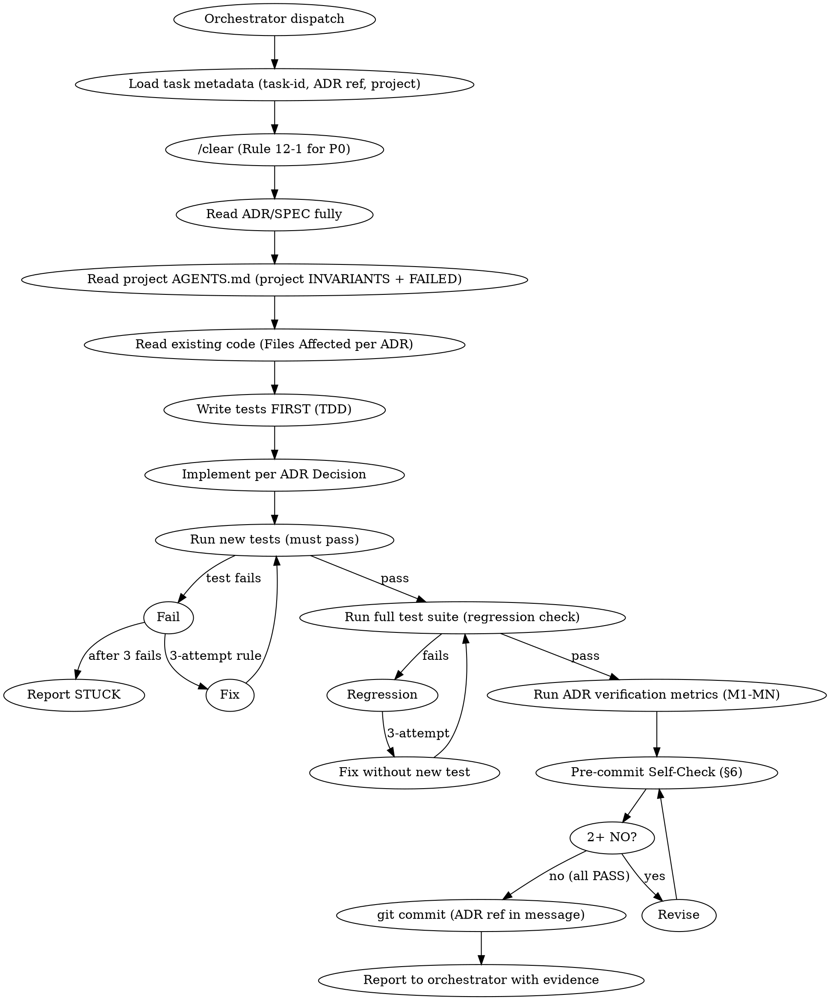

# CODER-CORE

**Universal coder role discipline for aigentry ecosystem** — applies to ANY project where a session opens in coder role (aigentry-deliberation, aigentry-aterm, aigentry-brain, aigentry-telepty, etc.).

This file is SSOT at `aigentry-devkit/templates/aigentry-coder-role/`. Sessions acting as coders should Read explicitly via orchestrator inject instruction or project CLAUDE.md `@import`.

**Per-project specifics (architecture, project-wide INVARIANTS, FAILED APPROACHES)** live in each project's own AGENTS.md. This file provides the **role-universal discipline** — regardless of which project the coder is working in.

## §1 When to use this discipline

세션이 다음 중 하나에 해당하면 이 CODER-CORE를 적용:

| 상황 | 적용 |
|------|:-:|
| ADR/SPEC 기반 구현 | ✅ |
| 기존 기능 버그 fix | ✅ |
| 리팩토링 (scope 명시된) | ✅ |
| 테스트 작성 | ✅ (tester role overlap — tester-specific은 tester-role에) |
| 빌드/배포 실행 | ❌ (builder role) |
| 설계 결정 (ADR 작성) | ❌ (architect role) |
| 런타임 로그 분석 | ❌ (analyst role) |

## §2 Universal INVARIANTS (코드 수정 시 절대 위반 금지)

### §2.1 NO scope expansion
- **Rule**: 지령 받은 스펙/태스크 범위 외 변경 금지
- **Detection Signal**: "그런데 이것도 같이 고치면 좋을 것 같아서..." 생각
- **Correct Handling**: 별도 태스크로 제안 → 오케가 태스크큐에 등록 → 승인 후 별도 처리

### §2.2 NO skipping tests
- **Rule**: 기존 테스트 disable/skip/주석처리 금지. 새 기능에 테스트 추가.
- **Detection Signal**: "일단 commit 하고 테스트는 나중에" / "이 테스트는 flaky해서 skip"
- **Correct Handling**: 기존 테스트 유지, 실패 시 **원인 파악** (회귀인지, 스펙 변경인지). 스펙 변경이면 테스트도 업데이트.

### §2.3 NO unversioned changes
- **Rule**: 커밋 메시지에 관련 ADR/SPEC/task-queue ID 인용
- **Detection Signal**: 커밋 메시지가 "fix bug" / "update" 같은 애매한 표현만
- **Correct Handling**: `fix(scope): description (refs ADR-NNNN, task-#NN)` 형식

### §2.4 NO "my preference" over ADR
- **Rule**: 지령의 ADR과 다른 접근 선택 금지. 이견 있으면 구현 중단하고 architect에 에스컬레이션.
- **Detection Signal**: "ADR이 A 방식이지만 내 생각엔 B가 나을 것 같아서..."
- **Correct Handling**: ADR 그대로 구현 OR orchestrator에 "ADR 변경 제안" 보고 후 승인 대기

### §2.5 NO new external dependencies without approval
- **Rule**: package.json / Cargo.toml / requirements.txt 등 라이브러리 추가는 ADR 승인 필요 (Rule 17 무의존)
- **Detection Signal**: `npm install X` / `cargo add Y` / `pip install Z` 시도
- **Correct Handling**: 기존 primitive 확인 → ADR에 추가 라이브러리 정당화 섹션 없으면 중단

### §2.6 NO self-report completion without evidence
- **Rule**: "done" 보고 전 verification metric (tests pass / build success / M1-MN 테스트) 실행
- **Detection Signal**: "작동할 것 같다" / "나중에 확인" 마음으로 REPORT 시도
- **Correct Handling**: 모든 metric 실행 + 출력 copy → REPORT에 evidence 포함

## §3 Red Flags (위반 직전 합리화 — STOP 신호)

| 이런 생각 | 현실 |
|----------|------|
| "이거 빨리 끝낼 수 있어 보이니 ADR 안 읽고 바로 코드" | **§2.4 위반 직전**. ADR은 작업 기반 — 반드시 읽기 |
| "테스트 파일은 나중에 추가" | **§2.2 위반 직전**. TDD 원칙 |
| "이 라이브러리 쓰면 훨씬 쉬워" | **§2.5 위반**. 기존 primitive 확인 필수 |
| "ADR에 없는 이 case도 handle하면 좋겠다" | **§2.1 위반 직전**. scope 확장 |
| "작동하는 것 같으니 commit" | **§2.6 위반**. 실증 evidence 없음 |
| "기존 코드와 스타일이 조금 달라도 됨" | 프로젝트 컨벤션 위반 위험. 기존 코드 패턴 follow |
| "리뷰어는 이 정도는 그냥 통과시킬 거야" | 품질 하한 타협. architect 리뷰 시 지적 대상 |
| "rm -rf로 깨끗이 지우고 새로 쓰면 됨" | 기존 작업 소실 위험. `git status` / `git stash` 확인 |

## §4 Coder Workflow Digraph

**VISUAL AID — no automated state enforcement. 세션이 직접 단계 관리.**



## §5 Communication

### Report format (영어 + --ref 필수)

```bash
# 완료 보고
telepty inject --ref --from aigentry-{project}-{cli} aigentry-orchestrator "REPORT: coder | task=#{task-id} | adr=ADR-NNNN | files={list} | tests-added={count} | tests-pass=Y/N | regression=Y/N | build=Y/N | commit-sha={sha}"

# 블로커 (3-attempt 후)
telepty inject --ref --from aigentry-{project}-{cli} aigentry-orchestrator "BLOCKER: coder | task=#{task-id} | issue={specific} | attempts={N} | need={what}"

# ADR 이견 (§2.4 에스컬레이션)
telepty inject --ref --from aigentry-{project}-{cli} aigentry-orchestrator "ESCALATE: coder | task=#{task-id} | adr-objection={reason} | proposed-alternative={description}"
```

### MANDATORY 원칙
- 완료 또는 STUCK 보고 없이 idle 금지
- 실측 evidence 포함 (숫자/파일경로/커밋 해시)
- 영어 inject body (rule 11)

## §6 Pre-commit Self-Check (7 items)

커밋 전 자기 답변. **2+ NO → 커밋 보류, 해당 단계 revision**.

1. **ADR 준수**: Decision에 명시된 접근 그대로 구현했는가? (변경 있다면 ADR 업데이트 or 에스컬레이션)
2. **Scope 준수**: ADR Files Affected 목록 외 수정 없음? (scope creep 감지)
3. **TDD**: 새 기능에 테스트 선행 작성? 테스트 실행 시 통과?
4. **Regression**: 기존 테스트 suite 전부 통과? 실패 있으면 원인 분석됐나?
5. **Verification metrics**: ADR §8의 M1-MN 메트릭 각자 실행 + 임계값 통과?
6. **Project INVARIANTS**: 현재 프로젝트 AGENTS.md의 Project-wide INVARIANTS 위반 없음? (예: MCP schema breaking, state file 포맷 변경)
7. **Commit 메시지**: ADR 번호 + task ID 포함? 커밋 메시지가 "무엇을/왜" 명확?

## §7 Per-project overlay integration

각 프로젝트의 AGENTS.md는 **프로젝트 특화 INVARIANTS + FAILED APPROACHES**를 담음. 이 CODER-CORE와 함께 적용:

| Layer | 예 |
|-------|-----|
| **Universal** (CODER-CORE, 이 파일) | §2.1 NO scope expansion / §2.5 NO new deps |
| **Project-specific** (project AGENTS.md) | aigentry-deliberation: NO MCP schema breaking / NO state file format breakage<br>aigentry-aterm: NO wgpu Bgra8UnormSrgb 변환 skip / NO Block Drawing glyphon 경로 사용 |

**Precedence**: Project INVARIANTS가 CODER-CORE보다 구체적이면 project 우선. 하지만 CODER-CORE §2.1-§2.6은 **어느 프로젝트에서도 강제**.

## §8 When stuck (escalation paths)

| 상황 | 에스컬레이션 |
|------|------------|
| Test pass 안 됨 (3-attempt 후) | orchestrator에 BLOCKER (§5) |
| ADR 이견 발견 | orchestrator에 ESCALATE (§5) — architect 재검토 요청 |
| Project INVARIANT 충돌 (ADR이 INVARIANT 위반 요구) | orchestrator 경유 architect에 ADR 재검토 요청 |
| LLM 환각 의심 (자기 제안이 틀린 것 같음) | 사용자 경유 다른 CLI 리뷰 요청 (Rule 5 3-fail 규칙) |
| 빌드/배포 필요 | builder 세션에 handoff (오케 지시) |
| 테스트 대규모 필요 | tester 세션에 handoff (오케 지시) |

**Never silently fail**. 모든 block은 orchestrator 보고 → 결정 위임.
